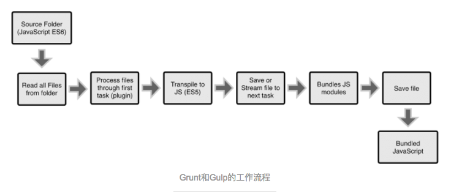
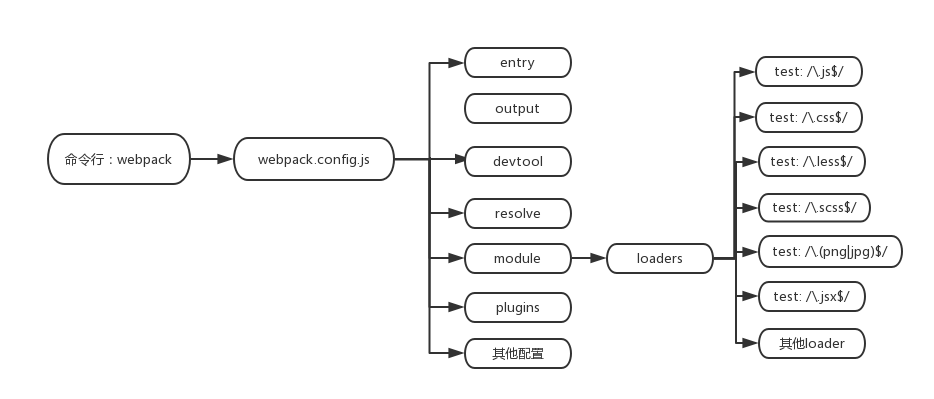

## lesson-1主要内容:构建一套适合 React、ES6 开发的脚手架

### Features

- 可以解析JSX语法
- 可以解析ES6语法新特性
- 支持LESS、SCSS预处理器
- 编译完成自动打开浏览器
- 单独分离CSS样式文件
- 支持文件MD5戳，解决文件缓存问题
- 支持图片、图标字体等资源的编译
- 支持浏览器源码调试
- 实现组件级热更新
- 实现代码的热替换，浏览器实时刷新查看效果
- 区分开发环境和生产环境
- 分离业务功能代码和公共依赖代码

### 前言:

Webpack 是当下最热门的前端资源模块化管理和打包工具。它可以将许多松散的模块按照依赖和规则打包成符合生产环境部署的前端资源。
还可以将按需加载的模块进行代码分隔，等到实际需要的时候再异步加载。通过 loader 的转换，任何形式的资源都可以视作模块，比如
CommonJs 模块、 AMD 模块、 ES6 模块、CSS、图片、 JSON、Coffeescript、 LESS 等。

#### Webpack 和 gulp 没有可比性

也许你用过gulp,有了gulp你可以对css ,js 文件进行压缩合并等处理,但随着前端技术不断发展,出现了前端资源模块化,资源按需
加载,ES6模块等,利用gulp来构建你的项目就显得力不从心了.如果非要做个对比的话,下面给出两张工作流程图片就明白了

>Grunt和Gulp的工作方式是：在一个配置文件中，指明对某些文件进行类似编译，组合，压缩等任务的具体步骤，这个工具之后可以自动替你
完成这些任务。



>Webpack的工作方式是：把你的项目当做一个整体，通过一个给定的主文件（如：index.js），Webpack将从这个文件开始找到你的项目的
所有依赖文件，使用loaders处理它们，最后打包为一个浏览器可识别的JavaScript文件。


### 项目构建，安装必要包

clone `git@github.com:ZengTianShengZ/react-lesson.git`

切到 在lesson-1 的根目录下执行以下命令，安装必要包
```
 npm install
 // 如果安装过 npm 淘宝镜像
 cnpm install
 // 如果是 Mac 需要权限
 sudo npm install
```

开发过程中你会用到以下命令进行打包编译:

| lesson-1根目录下运行命令行       | 解释   |  
| ------------- |:-------------:|  
| webpack     | 该命令会默认找到根目录下 webpack.config.js 文件并运行|  
| npm run dev     | 改命令会找到 根目录下的 package.json 文件 并运行 文件下的 scripts 下的 dev命令，其实也就执行 node server.js  |    
| npm run hot  | 改命令是同上 其实是执行 node server.hot.js   |     
| npm run build | 改命令是同上 ，会执行 webpack --config webpack.config.dist.js --progress --colors --watch -p|  ##

### 一、 webpack  基础讲解

> lesson-1 根目录下 执行 ‘ webpack ’ 命令
>执行该命令会执行 根目录下 webpack.config.js  ,其实这里是为了讲解 webpack 的工作原理和演示
> 项目用的最多的是执行 webpack.config.hot.js 和 webpack.config.build.js 后面会做讲解

webpack.config.js 大致流程图:



#### 1、entry

```
entry: {
        app: APP_FILE
    }
```

指定一个入口文件,webpack将会顺藤摸瓜识别所依赖的文件,再一个个进行接下去的解析处理

#### 2、output

```
output: {
        publicPath: './static/',     //编译好的文件，在服务器的路径,这是静态资源引用路径
        path: BUILD_PATH,            //编译到当前目录
        filename: '[name].js',       //编译后的文件名字
        chunkFilename: '[name].[chunkhash:5].min.js',
    },
```

指定一个出口路径,当webpack处理完依赖文件后,将输出文件输出到指定路径下
其中:
> filename: '[name].js'

指输出 js 文件名 同 entry: 的输入文件名的配置一样,这里是会输出 app.js

> chunkFilename: '[name].[chunkhash:5].min.js'

chunkFilename的解释 多谢一位同学的提醒,使用场景是对js文件进行按需加载时，会对输出的文件添加后缀 ,
 文件名加一个5位的 hash 值, 如果不配置 chunkFilename 的话会自定给 [name] 随便一个id如‘2aj32’，
 可读性就比较差。配合 react-router 可以查看效果。

#### 3、devtool

```
devtool: 'cheap-module-eval-source-map',
```

除了输出编译后的文件外,还会顺带输出一个 Source Map 。什么是 Source Map呢，Source map就是一个信息文件，里面储存着位置信息。也就是说，转换后的代码的每一个位置，所对应的转换前的位置。如转码后的 ES6文件或 React的jsx文件 当代码出错我们很难找到对应的出错位置，那
Source Map 就提供了一个对应关系，来指出错误的位置。

#### 4、resolve

```
resolve: {
        extensions: ['', '.js', '.jsx', '.less', '.scss', '.css'], //后缀名自动补全
    }
```
这个配置可以帮我们自动补全后缀名，当我们 import 一个 demo.js 时可以这么写不带后缀的

>import demo from 'demo';

#### 5、module
```
module: {
      loaders: [{
          test: /\.scss$/,
          exclude: /^node_modules$/,
          loader: ExtractTextPlugin.extract('style', ['css', 'autoprefixer', 'sass']),
          include: [APP_PATH]
      },{
          test: /\.js$/,
          exclude: /^node_modules$/,
          loader: 'babel',
          include: [APP_PATH]
      },{
          test: /\.(png|jpg)$/,
          exclude: /^node_modules$/,
          loader: 'url-loader?limit=8192&name=images/[hash:8].[name].[ext]',
          //注意后面那个limit的参数，当你图片大小小于这个限制的时候，会自动启用base64编码图片
          include: [APP_PATH]
      }, {
          test: /\.jsx$/,
          exclude: /^node_modules$/,
          loaders: ['jsx', 'babel'],
          include: [APP_PATH]
      }]
  },
```
webpack 的核心部分就是各种 loader 了 ，webpack 拿到入口文件，并顺藤摸瓜解析到各种依赖文件，遇到不同的文件后缀就执行对应的loader进行处理
其中
> test: /\.scss$/,

当依赖文件有以 .scss 后缀的文件，会先执行 sass-loader 再 执行 autoprefixer-loader（给一些css3添加后缀的loader）
接着执行 css-loader ，这才转化成立 .css 文件，才能作用于浏览器，而 style-loader 是将 .css 文件插入到 html的 head 头部
也许你会注意到 ExtractTextPlugin() 包裹一堆loader是干嘛的，这个放着下面 webpack的插件这一节讲

> test: /\.js$/,

当依赖文件有以 .js 后缀的文件 ，会经过 loader: 'babel', 这里多做了一步跳转是 babel会找到根目录下咱们配置的一个 .babelrc文件
```
{
  	"presets": [
  		"react",
  		"es2015",
  	 	"stage-0",
  	],
  	"plugins": [
        "transform-decorators-legacy",
        "transform-class-properties"
    ]
}
```
.js 文件会根据上面的配置进行解析

> test: /\.(png|jpg)$/,

```
{
    test: /\.(png|jpg)$/,
    exclude: /^node_modules$/,
    loader: 'url-loader?limit=8192&name=images/[hash:8].[name].[ext]',
    //注意后面那个limit的参数，当你图片大小小于这个限制的时候，会自动启用base64编码图片
    include: [APP_PATH]
}
```
图片干嘛需要 loader呢，上面也解释了 可以将一个较小的图片进行 base64转换

> test: /\.jsx$/,
React 独有的 .jsx 文件 ，相对 .js文件多了一步 jsx-loader

#### 6、plugins
```
plugins: [
        new webpack.DefinePlugin({
            'process.env': {
                NODE_ENV: JSON.stringify('development')    //定义编译环境
            },
            'cdnUrl':JSON.stringify('http:demo.com/'),
            'dev': true
        }),
        new HtmlWebpackPlugin({                            //根据模板插入css/js等生成最终HTML
            filename: '../index.html',                     //生成的html存放路径，相对于 path
            template: './src/template/index.html',         //html模板路径
            hash: false,
        }),
        new ExtractTextPlugin('[name].css')
    ],
```
其中：
> DefinePlugin

```
plugins: [
        new webpack.DefinePlugin({
            'process.env': {
                NODE_ENV: JSON.stringify('development')    //定义编译环境
            },
            'cdnUrl':JSON.stringify('http:demo.com/'),
            'dev': true
        })
    ]
```
定义一下全局变量，可以在模块中使用这些变量
如一个项目中依赖的 demo.js 文件
```
console.log(cdnUrl);
```
编译后的 demo.js 输出：
```
console.log(‘http:demo.com/’);
```
这个全局变量有什么作用呢，如果你有点项目经验就知道这个 plugin 的巨大好处了，举个小例子，咱们在项目开发时，线上环境
和开发环境是不一样的，比如 cdn资源路径，就可以定义全局变量来更改全局路径资源：
```
if(dev){ // dev 是 DefinePlugin 的一个全局变量

}else{

}
```

> HtmlWebpackPlugin

```
plugins: [
        new HtmlWebpackPlugin({                     //根据模板插入css/js等生成最终HTML
            filename: '../index.html',              //生成的html存放路径，相对于 path
            template: './src/template/index.html',  //html模板路径
            hash: false,
        })
    ],
```

依赖文件经过 webpack 编译完输出到指定的目录下 ，那怎么被 html 引用呢，那就需要 HtmlWebpackPlugin 插件。
用法上面有注释就不多说。

> ExtractTextPlugin

```
plugins: [
        new ExtractTextPlugin('[name].css')
    ],
```
我们会在 .js 文件 import .css 或 .scss 文件，webpack 编译 .js 文件时会将这个css文件打包进了 js文件里头。
但有时我们的 css文件比较大或想单独拿出来，那就可以利用这个插件 ExtractTextPlugin ，目的是生成单独的一份 css
文件，而不是打包到 .js 文件里头

编译前：


编译后：


### 二、开发环境下的 webpack -- 热刷新

在实际开发中不可能编译一下webpack 在浏览器刷新看一下结果，编辑完再编译一下webpack，再刷新浏览器看一下效果。这样工作效率非常低
也很不爽。
下面咱们就来构建一套实际开发时的 webpack 来构建项目。webpack 的配置整体上跟第一节讲的差不多，主要在热部署上多做些处理而已。

#### 1、启动热刷新
与第一节不同的是，我们不是通过命令行 `webpack` 来启动编译，而是通过一个service服务 。可以在lesson-1 根目录下执行命令

> npm run hot  或  node server_hot.js  // 其实 npm run hot 也是找的跟目录下的 package.json 执行 node server_hot.js 的

执行完命令 试着改变一样 js文件或scss文件保存一下，发现浏览器页面是自动刷新的。但 build 目录下却不见得有任何输出。
这是因为我们使用了 热刷新 的一个`中间件` ，每次保存完文件会自动编译项目中依赖的 js 和 css 文件，编译完的输出文件输出到
`计算机的内存中` 这样在开发的过程中不用每次读写硬盘，速度也会快很多

#### 2、中间件 webpack-dev-middleware
上面第一小点提到一个`中间件`，那这个中间件到底怎么工作的呢，会使得咱们在开发过程中热刷新。或者说 执行命令行 `npm run hot`后
都做了哪些。下面一幅图带你理解：


#### 3、 npm run hot
运行命令行 `npm run hot` 其中就是执行 `server_hot.js` 这个文件，启动一个 server ，里面涉及到 nodejs的一些知识和Node.js Express 框架 ，对这一块不太熟悉的可以看这里 [Node.js 教程| 菜鸟教程](http://www.runoob.com/nodejs/nodejs-express-framework.html)

##### （1）、分析 server_hot.js
```
var webpack = require('webpack');
var express = require('express');
var config = require('./webpack.config.hot');

var app = express();
var compiler = webpack(config);

app.use(require('webpack-dev-middleware')(compiler, {
	publicPath: config.output.publicPath,
	hot: true,
	historyApiFallback: true,
	inline: true,
	progress: true,
	stats: {
	colors: true,
	}
}));

app.use(require('webpack-hot-middleware')(compiler));自动刷新的消息通知依靠的是浏览器和服务器之间的web socket连接

//将其他路由，全部返回index.html
app.get('*', function(req, res) {
	res.sendFile(__dirname + '/index.html')
});

app.listen(8088, function() {
	console.log('正常打开8088端口')
});

```

##### （2）、看一下下面例子解释一下 app.use（）


```
var express = require('express');
var app = express();
app.use(function (req, res, next) {   // 没指定路径默认是 app.use('/',function(){}) 访问根路径                                                    //会进入这个函数
  console.log('Time:', Date.now());
  next();
});
```
也就是 当 服务端接收到一个请求时，会先被 app.use（）拦截下，因为 app.use（）没有指定路径，默认接收根路径，
如 访问 http://127.0.0.1:8088/ ，那么网络请求就会先被app.use（）拦截下。

app.use（）处理完事情就会交给 下面的 get 或 post 请求了：
```
//将其他路由，全部返回index.html
app.get('*', function(req, res) {
	res.sendFile(__dirname + '/index.html')
});
```
这里 get 收到请求后就给浏览器一个 响应（response） `res.sendFile()` 对浏览器输出 index.html

##### （3）、看一下 webpack-dev-middleware 中间件

```
app.use(require('webpack-dev-middleware')(compiler, {
	publicPath: config.output.publicPath,
	hot: true,
	historyApiFallback: true,
	inline: true,
	progress: true,
	stats: {
	colors: true,
	}
}));
```
上面一小点说到了 app.use 会收到请求后先做一些处理 ，处理内容就是 webpack-dev-middleware 来完成,
这也是热更新的关键。自动刷新的消息通知依靠的是浏览器和服务器之间的 `web socket` 连接. 当保存一下文件（command+s或Ctrl+s）
浏览器就会通过 连接 向服务端发送请求，服务端接收请求后 先被 app.use（）拦截下来，经过 webpack-dev-middleware 中间件
处理,处理完 交给 app.get（）输出 index.html 到浏览器，至此，浏览器自动刷新完成！

其中 webpack-dev-middleware 中间件 接收两个参数，一个是 `webpack(config)` 这就是用于编译 js css 的配置文件了，咱们在第一大节已经介绍了，里面的内容跟第一大节差不多，几处修改后面会解释。第二个参数是一个配置对象 具体看[github-webpack-dev-middleware](https://github.com/webpack/webpack-dev-middleware)

##### （4）、 最后看一下 webpack-hot-middleware

```
app.use(require('webpack-hot-middleware')(compiler));
```
如果一些文件的小改动比如 改变一个 div 的颜色啊，都有经过一大堆的编译那效率就太低了，所以 webpack-hot-middleware 可以对一些小
改动快速刷新浏览器，配合 webpack-dev-middleware 使用。

### 4、 热跟新的配置文件 webpack.config.hot.js
这个配置文件其实跟第一大节讲的并无太大区别，只不过要配合热刷新需要新添加如下配置：
entry 添加 webpack-hot-middleware/client
```
entry: {
    app: [
        'webpack-hot-middleware/client',
        APP_FILE
    ]
},
```
plugins 添加如下：
```
plugins: [
    new webpack.HotModuleReplacementPlugin(),
    new webpack.NoErrorsPlugin()
]
```

### 三、 线上环境下的 webpack

一般呢，项目开发完要发布到服务器，是需要配合另一套的项目打包流程的，发布到服务器的项目是不需要热更新等一些辅助开发的流程，
但同时根据项目的情况需要加入一些比如 压缩代码，抽离公共代码，异步加载js 等 需求。下面配合打包线上项目的 `webpack.config.build.js`
来说一下如何打包线上项目的。

#### 1、npm run build

在lesson-1 根目录下运行命令 `npm run build` ，根目录会输出以下文件：


运行命令 `npm run build` 是找到 根目录下的 package.json 文件执行 scripts 下的 build命令，其实就是执行：
```
"build": "webpack --config webpack.config.build.js --progress --colors --watch -p"
```
> --config webpack.config.build.js 指定 命令执行的文件
> --progress 指定在控制台输出进度条
> --colors  控制台显示颜色

#### 2、分析 webpack.config.build.js
```
var path = require('path');
var webpack = require('webpack');
var ExtractTextPlugin = require('extract-text-webpack-plugin'); //css单独打包
var HtmlWebpackPlugin = require('html-webpack-plugin'); //生成html

//定义地址
var ROOT_PATH = path.resolve(__dirname);
var APP_PATH = path.resolve(ROOT_PATH, 'src');              //__dirname 中的src目录，以此类推
var APP_FILE = path.resolve(APP_PATH, 'app');               //根目录文件app.jsx地址
var BUILD_PATH = path.resolve(ROOT_PATH, './build/static'); //发布文件所存放的目录/pxq/dist/前面加/报错？

module.exports = {
    entry: {
        app: APP_FILE,
        common: [
            "react",
            'react-dom',
            'react-router',
            'redux',
            'react-redux',
            'redux-thunk',
            'immutable'
        ]
    },
    output: {
        //publicPath: 'http:example.cdn/',   // 给资源文件添加前缀，一般会把静态资源发布的 cdn 上
        path: BUILD_PATH,                    //编译到当前目录
        filename: '[name].js',               //编译后的文件名字
        chunkFilename: '[name].[chunkhash:5].min.js',
    },
    resolve: {
        extensions: ['', '.js', '.jsx', '.less', '.scss', '.css'] //后缀名自动补全
    },
    module: {
        loaders: [{
            test: /\.js$/,
            exclude: /^node_modules$/,
            loader: 'babel'
        }, {
            test: /\.css$/,
            exclude: /^node_modules$/,
            loader: ExtractTextPlugin.extract('style', ['css', 'autoprefixer'])
        }, {
            test: /\.less$/,
            exclude: /^node_modules$/,
            loader: ExtractTextPlugin.extract('style', ['css', 'autoprefixer', 'less'])
        }, {
            test: /\.scss$/,
            exclude: /^node_modules$/,
            loader: ExtractTextPlugin.extract('style', ['css', 'autoprefixer', 'sass'])
        }, {
            test: /\.(eot|woff|svg|ttf|woff2|gif|appcache)(\?|$)/,
            exclude: /^node_modules$/,
            loader: 'file-loader?name=[name].[ext]'
        }, {
            test: /\.(png|jpg|gif)$/,
            exclude: /^node_modules$/,
            loader: 'url-loader?limit=8192&name=images/[hash:8].[name].[ext]',
            //注意后面那个limit的参数，当你图片大小小于这个限制的时候，会自动启用base64编码图
        }, {
            test: /\.jsx$/,
            exclude: /^node_modules$/,
            loaders: ['jsx', 'babel']
        }]
    },
    plugins: [
        new webpack.DefinePlugin({
            'process.env': {
                NODE_ENV: JSON.stringify('production') //定义生产环境
            }
        }),
        new HtmlWebpackPlugin({                    //根据模板插入css/js等生成最终HTML
            filename: '../index.html',             //生成的html存放路径，相对于 path
            template: './src/template/index.html', //html模板路径
            inject: 'body',
            hash: true,
        }),
        new ExtractTextPlugin('[name].css'),
        //提取出来的样式和common.js会自动添加进发布模式的html文件中，原来的html没有
        new webpack.optimize.CommonsChunkPlugin("common", "common.bundle.js"),
        new webpack.optimize.UglifyJsPlugin({
            output: {
                comments: false, // remove all comments （移除所有注释）
            },
            compress: {          // 压缩
                warnings: false
            }
        })
    ]
};
```
与前面讲的第一大节相比，并无明显区别，主要是加了一些将项目发布到服务的线上流程。
其中：
##### （1）、entry
```
entry: {
    app: APP_FILE,
    common: [
        "react",
        'react-dom',
        'react-router',
        'redux',
        'react-redux',
        'redux-thunk',
        'immutable'
    ]
},
```
添加了 common 用来单独打包出公共部分的 js代码

##### （2）、plugins

```
plugins: [
    new ExtractTextPlugin('[name].css'),
    new webpack.optimize.CommonsChunkPlugin("common", "common.bundle.js"),
    new webpack.optimize.UglifyJsPlugin({
        output: {
            comments: false, // remove all comments （移除所有注释）
        },
        compress: {          // 压缩
            warnings: false
        }
    })
]
```
webpack.config.build.js 新添了几个 plugins 。首先要清楚的一点是 webpack 是将一块块的依赖打包的一个文件里头的，
不管是 js 、scss、less、css、jsx 文件都会编译成一块块的代码打包到一个文件里头。那插件可以将一块块的代码看是压缩或提取出来
`ExtractTextPlugin` 插件的作用就是将 css块区域的代码单独提取出来的。
`CommonsChunkPlugin` 是用来提取公用的代码块。有两个参数 `common` 是对应 entry 的字段，`common.bundle.js`是将
公共代码输出到 `common.bundle.js` 文件里。
`UglifyJsPlugin` 是将打包后的代码镜像压缩。

### 总结

lesson-1 主要是对 webpack 打包编译的一些讲解和梳理。
- 第一节讲了 webpack 的简单工作原理，                               // webpack
- 第二节讲了 实际开发过程中 支持浏览器自动刷新，对webpack进行相应的改造， // npm run hot
- 第三节讲了 将项目发布到线上的一些实际打包的工作流程。                 // npm run build

后面还有 lesson 来讲解 React 配合 Redux、 Router 在实际项目中的应用和开发，喜欢的话可以先 `star` 一下哦！！！
