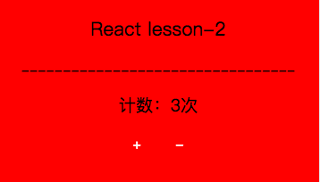
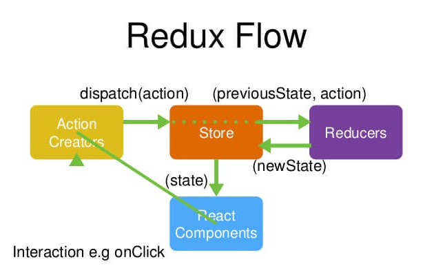
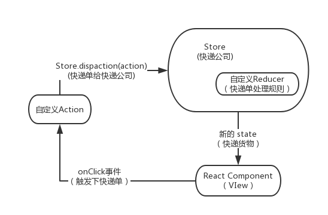
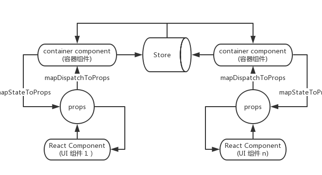

## lesson-2 主要内容: Redux 的设计思想

### 前言
Redux是什么呢？一个状态管理工具。那是干嘛用的呢？都知道，React可以进行单页应用的开发，可以对页面
中各个模块进行分割形成组件，而组件之间就避免不了事件的传递或数据的交互，那Redux就是用来对这些组件
的状态进行管理的。就好比买家和卖家，快递是交给第三方（Redux）去完成。

### 前言（续）
也行你会说，React不是有自己的一套数据传递和事件管理机制么，何必要引入第三方来插一脚，那么麻烦呢。
这里有一些场景来说明引用 React 是否必要：
#### 1、你不需要使用Redux
```
用户的使用方式非常简单
用户之间没有协作
不需要与服务器大量交互，也没有使用 WebSocket
视图层（View）只从单一来源获取数据
```
#### 2、你需要Redux
```
用户的使用方式复杂
不同身份的用户有不同的使用方式（比如普通用户和管理员）
多个用户之间可以协作
与服务器大量交互，或者使用了WebSocket
View要从多个来源获取数据
```
当然啦，本篇章讲述的例子是不需要用到 Redux 这一套状态管理工具的，但为了讲解就需要简单的例子来说明
> 用一个简单的例子来深入浅出的理解 Redux的设计思想：
一个简单的加减器，点击加号加一，点击减号减一



### 一、Redux 的工作流程 （快递思想）



看图感觉有点乱，梳理一下就清楚了，首先对以上图几个名词做个解释，它们分别是干嘛用的，有什么功能

#### 1、 Store（快递公司）
Store 可以看成是一个容器，整个应用只能有一个 Store ，就好比整个应用只能指定京东快递公司来运货。
```
import {createStore, combineReducers, applyMiddleware} from 'redux';
const store = createStore(reducer);
```
#### 2、 State （快递物件）
State ：一状态下的数据，一时间点下的数据。Store对象包含所有数据，想要得到某个时间点的数据，就要
对Store生成快照，得到一个数据集合，就叫做state。 `store.getState()`可以得到state。
Redux规定一个State对应一个View，反之亦然。 就好比一个快递物件只能给对应的主人，不能给其他人。
```
import {createStore, combineReducers, applyMiddleware} from 'redux';
const store = createStore(reducer);
store.getState()
```
#### 3、Action （快递单）
买家要买东西怎么办，当然要先下单啦。用户只能操作 View（比如对view进行点击），用户是接触不到State的，
那State的变化对应View的变化，这就需要View通过一个Action对象来通知State的变化。就好比通过一个
快递下单（发送一个Action），才有接下去的物流等一系列操作不是吗。
Action是一个自定义对象，其中`type`属性是必现的
```
cost action = {
  type:'btnClick',
  msg:'信息字符串，不是必现'
}
```
#### 4、store.dispatch() (给快递公司货单)
store.dispatch() 是view发出Action的唯一方法，store.dispatch()接受一个Action对象，将他发出去。
现在还没发货，只是把订单信息给京东快递而已，京东是自营企业，有自己的物流仓库和物流中心，搜到订单信息
再根据订单来发货。
```
store.dispatch(action);
```
#### 5、Reducer （包装货物）
Store 收到一个Action后，必须给出一个新的State，这样view才会发生变化，而新的State的计算过程就是
Reducer来完成的。
就想收到一个订单（Action）后，需要根据订单来选取货物，进行包装。
Reducer是一个自定义函数，它接受Action和当前的State作为参赛，返回一个新的State
```
const reducer = (state=defaultState,action) =>{
  switch (action.type) {
  case 'btnClick':
    return state + action.msg +'更新';
  case '其他type':
    return state + ‘其他action.msg’;
  /*
    可添加更多的 case type 来匹配不同的Action
  */
  default:
    return state;
  }  
}
```
接下来 我们把这套处理订单的规则（Reducer）给快递公司（Store），以后有订单只需要根据这套规则来发货就行了
```
import { createStore } from 'redux';
// store.dispatch 方法会触发 Reducer 的自动执行
const store = createStore(reducer);
```
也许你会疑问那需要发送不同的 Action怎么办 ，没错就是增加订单规则就可以了，往 Reducer 里面增加 case ’type’的规则

#### 6、store.subscribe() （接受快递）
当 State一旦发生变化，那么 store.subscribe() 就会监听到自动执行。 好比收到了快递（秒送，哈哈）
那收到快递能干嘛呢，每错，就是在这里重新渲染 View 更新View咯。
```
let unsubscribe = store.subscribe(() =>
  console.log(store.getState())
  render（）{
      更新view ！！！
  }
);
// 也可以取消订阅（监听）
unsubscribe();
```
#### 小结


下面讲解 Redux 在 React下的应用 --  React-Redux

### 二、Redux 在 React下的应用 （React-Redux）

如果使用第一节讲述的 Redux 的那一套状态管理方法来对 React进行数据管理，也是可以的，但就有些麻烦。
比如咱们要在最后自己定义更新View
```
store.subscribe(() =>
  console.log(store.getState())
  render（）{  // React 的 render（）方法
      更新view ！！！
  }
);
```
为了使用方便，Redux的作者封装了一个React专用的库 `React-Redux`

#### 1、React-Redux
React-Redux 将组件分为两大类，UI组件和容器组件。UI组件只负责UI的呈现，而容器组件用来管理数据和事件。
那怎么把交互和UI联系起来呢，那就使用 React-Redux 提供的 connect 方法。

#### 2、connect（）
React-Redux 提供的 connect 方法。就是将 UI组件个容器组件联系起来，那规则是什么呢？
需要有：
```
输入逻辑：外部数据（state对象）转为 UI组件的参数
输出逻辑：用户发出的动车 （Action对象）从UI组件传递出去
```
因此，connect方法的API是这样的：
```
import { connect } from 'react-redux'

const Comp = connect(
  mapStateToProps,
  mapDispatchToProps
)(UI)
```
connect方法接受两个参数：mapStateToProps 和 mapDispatchToProps ，前者负责输入逻辑，将state映射到
UI组件的参数 props ，后者负责输出逻辑，将用户对UI的操作映射成Action。

##### （1）、mapStateToProps（）
mapStateToProps是一个函数，`建立一个 state对象到UI组件的props对象的映射关系！`是映射到UI组件的props
对象上（关键点，多提醒一下，下面会做解释）。
```
const mapStateToProps = (state) => {
    return {
        count: state.count
    }
};
```
mapStateToProps 接受参数state，state的字段（state.count）赋值给 count 属性，而count属性是UI组件的
同名参数。
mapStateToProps会定义 Store，每当 state更新就会自动执行这个方法，那自动执行这个方法怎么就会更新UI呢，
UI更新一个来自自身的 `this.state` 变化，还有一个来自 `this.props`变化都会触发React组件重新render（），
而 就上面例子 mapStateToProps 接受 state 的变化从而返回一个 赋值 count属性，而这个属性是对应UI组件的
props对象的映射，props变化自然会带动UI组件的更新。

##### (2)、mapDispatchToProps()
mapDispatchToProps 是 connect的第二个参数，也是一个函数（还可以是一个对象）。mapDispatchToProps作为函数，
应该返回一个对象，该对象的每个键值对都是一个映射，定义了 UI 组件的参数怎样发出 Action。又是一个映射到UI组件的
props参数上！！！
```
const mapDispatchToProps = (dispatch, ownProps) => {
    return {
        increase: (...args) => dispatch(actions.increase(...args)),
        decrease: (...args) => dispatch(actions.decrease(...args))
    }
};
```
上面 mapDispatchToProps函数接受两个参数，返回一个对象，注意返回对象的属性是对应UI组件的props参数的。
也就是UI组件怎么派发一个Action呢，那就是 UI组件调用 `props.increase`  就会执行 dispatch（Action）
操作，从而派发一个Action。

#### 3、<Provider> 组件
上面多次提到 属性映射到props组件上，子组件在通过props拿到数据或方法进行操作，那props对应的组件是谁呢，
也就是子组件的父组件是谁呢。
React-Redux 就提供了<Provider> 组件 来充当所有UI组件的容器组件，所有UI组件都可以利用props属性想
<Provider> 组件拿数据。而<Provider> 组件的数据由 store提供。
```
render(
    <Provider store={store}>
        <Index></Index>
    </Provider>,
    document.body.appendChild(document.createElement('div'))
);
```

#### 小结
由下图可以看出 React-Redux 的大致工作原理，可以看出UI组件确实只负责UI部分，只通过props参数拿数据和对外
派发数据，而没有多做业务上的逻辑。而业务逻辑和数据呈现交给了容器组件，UI组件和容器组件是通过 connect（）
方法链接的，内部是通过 mapStateToProps 和mapDispatchToProps进行数据传递的。整个应用的数据都会经过
Store这个中央处理器的处理。所以不同UI组件之间的数据交互可以把数据都丢给Store这个中央处理器处理，Store
再把处理好的数据回传给各个UI组件就可以了
 

 ### 三、小例子：加减器

 

 用一段代码来巩固前面所学习的知识。实践强化嘛！哈哈

 Main.jsx:
 ```
 import React, {Component, PropTypes} from 'react';
 import {connect} from 'react-redux';

 /**
 * 定义一个 Main组件
 */
 class Main extends Component{
     constructor(){
         super();
         this.pClick =() =>{
             console.log('sssssssss');
         };
         this.state = {
             num:0,
             age:666
         }
     }
     render(){
         // 拿到 this.props 参数
         const {count, increase, decrease} = this.props;
         return(
             <div>
                 <p className="lesson-2">React lesson-2</p>
                 <p>
                     ---------------------------------
                 </p>
                 <div className="count">
                     <div>计数：{this.props.count}次</div>
                     <span className="btn" onClick={increase}>+</span>
                     <span className="btn" onClick={decrease}>-</span>
                 </div>
             </div>
         )
     }
 }
 /**
 * 用来给 组件传递数据
 * @param state
 */
 const mapStateToProps = (state) => {
     return {
         count: state.count
     }
 };
 /**
 *用来组件给 容器组件派发数据
 * @param dispatch 派发 Action
 * @param ownProps 组件自身的 props参数
 */
 const mapDispatchToProps = (dispatch, ownProps) => {
     return {
         increase: (...args) => dispatch(actions.increase(...args)),
         decrease: (...args) => dispatch(actions.decrease(...args))
     }
 };
 /**
 * actions
 */
 const actions ={
     increase:() => {
       return {type: 'INCREASE'}
     },
     decrease: () => {
       return {type: 'DECREASE'}
     }
 };
 /**
 * 连接 UI组件 和 容器组件
 * @param mapStateToProps     输入逻辑
 * @param mapDispatchToProps  输出逻辑
 */
 const Comp = connect(mapStateToProps, mapDispatchToProps)(Main);
 /**
 *  输出一个容器组件
 */
 export default Comp;
```
App.js
```
import React,{Component,PropTypes} from 'react';
import ReactDOM, {render} from 'react-dom';
import {Provider,connect} from 'react-redux';
import {createStore, combineReducers, applyMiddleware} from 'redux';
import Index from './Component/Main.jsx';
import './Style/comm.scss'

const store = createStore(reducer);
//监听state变化
store.subscribe(() => {
    //console.log(store.getState())
});
const reducer = (state = {count: 0}, action) => {
    switch (action.type){
        case 'INCREASE': return {count: state.count + 1};
        case 'DECREASE': return {count: state.count - 1};
        default: return state;
    }
}
render(
    <Provider store={store}>
        <Index></Index>
    </Provider>,
    document.body.appendChild(document.createElement('div'))
);
```

你也可以 clone本项目运行调试
```
clone git@github.com:ZengTianShengZ/react-lesson.git
cd lesson-2
npm install
npm run hot
```

## 总结

以上是对 Redux 的学习和体会，很多资料来源于网上和大神的博客，如有疑问的话可以 issue，
觉得有帮助的话可以 `star` 一下本项目哦 ^-^
