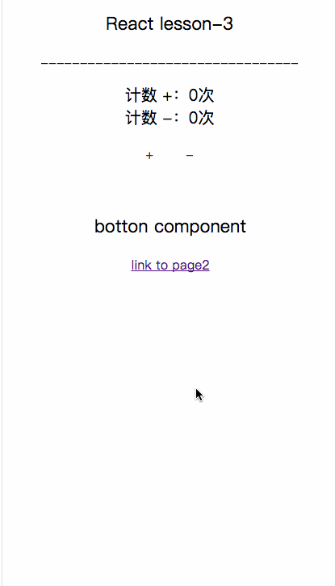
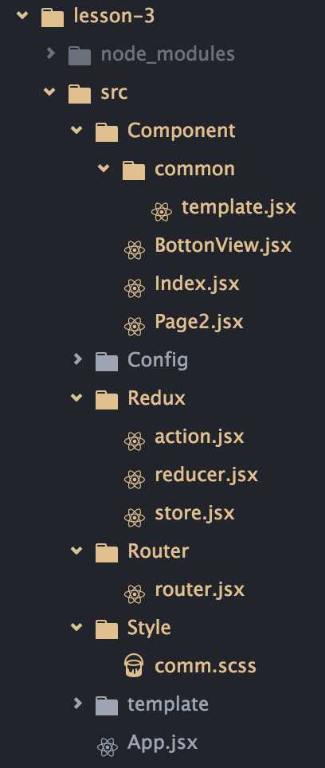
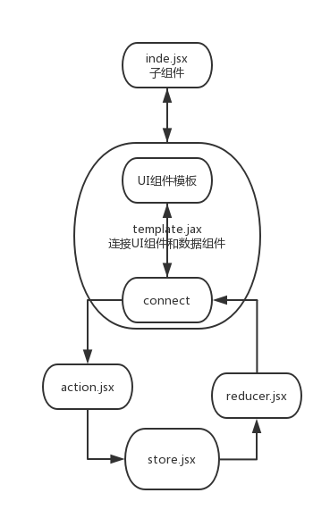

## lesson-3 构建 React 项目开发模板

### 前言：
在 `lesson-1 :构建一套适合 React、ES6 开发的脚手架`,`lesson-2 : Redux 的设计思想`,
我们已经对利用 React 构建项目有了一些基础知识，那推出 `构建 React 项目开发模板` 是为了在
实际的项目中有一套完善的体系或机制来迎合我们实际的开发需求，比如在 lesson-2 中，虽然我们已经
能让项目带着 Redux 这么一个数据状态管理机器给运转起来了，那 lesson-3 就是对 React 结合
react-redux 进一步封装，使开发更加清爽，项目也更加容易迭代和维护。

先看一下本项目封装完的一个案例：



### 前言2：
如果对下面知识点的补充不是很熟悉，可以先看前篇我写的内容 [lesson-2 : Redux 的设计思想](https://github.com/ZengTianShengZ/react-lesson/blob/master/lesson-2/README.md)

### 我们还需要一些中间件
在封装项目的过程中，我们还需要一些好用的中间件来支持我们的封装。
#### 1、combineReducers
`combineReducers` 函数是用来对 reducer 函数进行拆分的。我们在 reducer 函数里进行case 多条来着
Action 派发过来的数据，并返回 State ，但在项目复杂，数据一多的情况下，在一个reducer 函数里面处理
多条不同的数据就显得比较乱：
```
const chatReducer = (state = defaultState, action = {}) => {
  switch (action.type) {
    case TYPE1:
      // ...
       return state;
    case TYPE2:
       // ...
     return state;
    case TYPE3:
       // ...
    return state;
       //...
    default: return state;
  }
};
```
有了 `combineReducers` 我们可以这么写 reducer：
```
//  reducer.jsx
export const reducerData1 =  (state ={}, action={}) => {
    switch (action.type){
              case 'TYPE1':
              return {count:233};
        default: return state;
    }
};
export const reducerData2 =  (state ={name:'曾田生'}, action={}) => {
    switch (action.type){
              case 'TYPE2':
              return {
                name:state.name,
                age:'233'
              };
        default: return state;
    }
};
// ...
```
最后绑定到 store上：
```
// store.jsx
import * as reducer from './reducer'
var store = createStore(
    combineReducers(reducer),
    applyMiddleware(thunk)
);
export default store;
```
合并后的 reducer 保存的是各个子reducer的state数据，合并成一个state对象。比如上面 reducer.jsx 得到的数据是：
```
state:{
  reducerData1:{
    count:233
  },
  reducerData2:{
    name:'曾田生',
    age:'233'
  }
}
```

#### 2、applyMiddleware
简单解释是可以包装 store 的 dispatch（） 方法，比如对 store.dispatch（）的时候包装一个异步请求的网络处理机制啊。

#### 3、redux-thunk
虽然 applyMiddleware 允许 store.dispatch（action）多做一些事，但 dispatch 只能接收的参数是一个对象（action），
那怎么多做事呢，redux-thunk 改造了 store.dispatch（），使 dispatch 能接收一个函数做参数，有了函数做参数那么能做
的功能就多了。
```
// action.jsx
export const increase = () => {
  return {type: 'INCREASE'}
}
```
将action绑定到组件上：
```
import  * as action from '../../Redux/action.jsx'

connect(mapStateToProps, action)(Index);

```
注意 action.jsx export 的是函数，而且不用 dispatch（），直接 return action 就可以了，这得力于有了 redux-thunk
帮我们做的事。


### 我们需要更好的工具

#### 1、Fetch 网络请求插件
Fetch标准定义了请求，响应和绑定它们的进程 。也许你会想，网络请求不是有 Ajax，自己封装一个不就好了，或者jQuery的
$.ajax不是很流行很好用了吗。但基于事件的异步请求在多任务的处理中还是很不方便的。Fetch API 是基于 Promise设计的，
这样极大的好处是，请求到数据不用使用层层回调，可以用链式操作的方式处理我们的数据。
还不是很清晰的话可以[点开这个链接看看](https://github.com/camsong/blog/issues/2)
结合 React 的使用：
```
// action.jax
import fetch from 'isomorphic-fetch'  
export const fetchData = (url ,data) => {
  // 派发给 reducer 说明现在正在网络请求
   dispatch（{type:'GETDATA_STAR'}）
   return dispatch =>{
     fetch(url,{
        mode: 'cors',
        "Content-Type": "application/json"
     })
      .then(function(response) {
          if (response.status >= 400) {
              throw new Error("Bad response from server");
          }
          return response.json();
      })
      .then(function(data){
          // 最后得到数据派发给 reducer ，表示数据请求成功并返回数据
           return dispatch({type:"GETDATA_END",data:data}});
      })
      .catch(function(error) {
          console.log('Request failed', error)
      });
   }
}
```

#### 2、immutable.js 优化React性能
immutable 不可变的意思。JavaScript 中的对象一般是可变的（Mutable），因为使用了引用赋值，
新的对象简单的引用了原始对象，改变新的对象将影响到原始对象。如 foo={a: 1}; bar=foo; bar.a=2
你会发现此时 foo.a 也被改成了 2。虽然这样做可以节约内存，但当应用复杂后，这就造成了非常大的隐患.
特别在 React中，数据的改变会触发组件的重新 render。有了 immutable ，就可以对数据进行深度比较，
对有真正改变数据的组件才进行 render（）. 更多内容可跳转该链接 [Immutable 详解及 React 中实践](https://github.com/camsong/blog/issues/3)


### 怎么封装我们的 React 项目
前面吧啦吧啦一大堆，具体还是得看在项目中是怎么封装和应用的，不然就太抽象了。
先看项目的结构图：



相对于 lesson-2 我们单独抽出了 action reducer 和 store ，外加了一个 router组件
还有一个 template.jax ，这个是来作为所有组件的模板的。可以看下面的草图了解各个文件在
项目中扮演的角色：



在项目中也有很好的注解，可以 clone 本项目进行运行分析
```
clone git@github.com:ZengTianShengZ/react-lesson.git
cd lesson-3
npm install
npm run hot
浏览器打开： http://127.0.0.1:8088/
```

## 总结：
lesson-3 主要是延续了 lesson-2 的内容，对结合 react-redux 的React项目做了封装，让React在
实际项目开发中更加清爽，项目也更加容易维护。为此也介绍了一些新的知识点 combineReducers 和 redux-thunk
中间件，以及好用的网络请求 Fetch 工具等。

至此，react项目构建三部曲 告一段落 ，有不足的地方还请大家 issue ，欢迎 `star`
本人也在继续努力的学习中，会让这个项目更加完善，谢谢！
