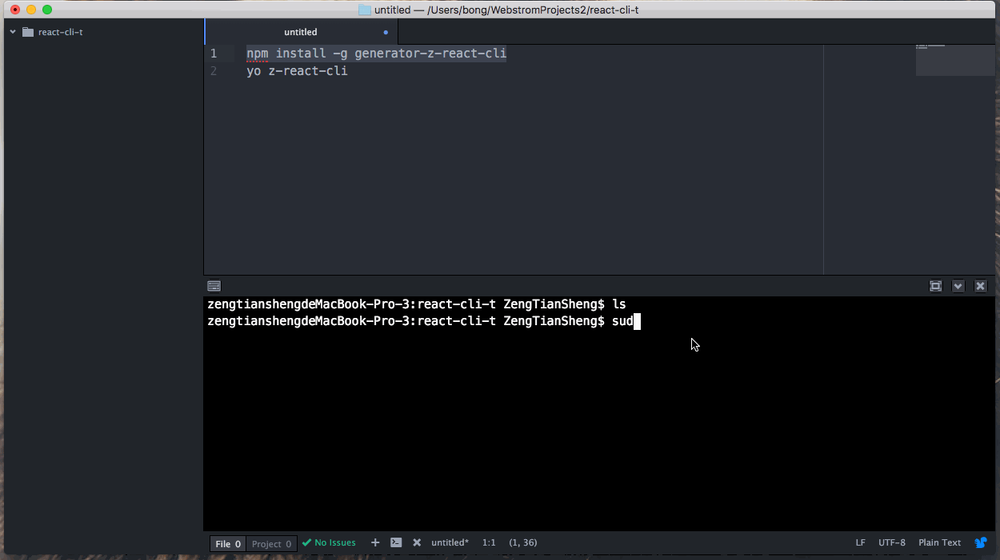

# React 脚手架

      


之前在开发 Vue 项目的时候,用到了 vue-cli 脚手架,很是方便.到了 React项目,想着是否自己
也可以定制一套实用的脚手架,刚好,了解到可以做基于yeoman generator的npm包.于是倒腾出来这套
基于 react+es6+redux+router 的架手架.




## webpack Feature

   - 可以解析JSX语法
   - 可以解析ES6语法新特性
   - 支持LESS、SCSS预处理器
   - 编译完成自动打开浏览器
   - 单独分离CSS样式文件
   - 支持文件MD5戳，解决文件缓存问题
   - 支持图片、图标字体等资源的编译
   - 支持浏览器源码调试
   - 实现组件级热更新
   - 实现代码的热替换，浏览器实时刷新查看效果
   - 区分开发环境和生产环境
   - 分离业务功能代码和公共依赖代码  


##  目录结构
```
  z-react-cli
  |-- index.html // 启动页(主页)
  |-- build //构建目录，遵循发布系统规范
  |    |-- index.html   //静态页面
  |    |-- static       //资源文件发布到cdn,或发布到服务器  
  |
  |-- src                     //源码目录
  |    |--component           // 组件
  |    |      |-- common      //公共组件
  |    |      |-- temp        //父组件
  |    |--Config              //工具方法
  |    |--Image               //图片资源
  |    |--Redux               // react-redux 数据状态管理
  |    |      |-- action.jsx  // 派发数据的 action
  |    |      |-- reducer.jsx //用于处理 action 的 reducer
  |    |      |-- store.jsx   //数据管理器
  |    |-- Router           //路由
  |    |-- Style            //样式
  |    |-- template         //编译html模板
  |    |-- App.jsx          //js 入口文件
  |-- static                // 源码静态资源(公共资源)
  |
  |-- webpack.config.hot       // 本地热编译
  |-- webpack.config.buildt    // 编译发布测试环境
  |-- webpack.config.online    // 编译发布线上环境

```

## 使用脚手架 -- generator-z-react-cli

首先确确保自己安装了 nodejs , 然后全局安装 yeoman
```
npm install -g yo
```

然后安装 脚手架

```
npm install -g generator-z-react-cli

```

最后新建个空文件夹,在文件夹里生成项目
```
yo z-react-cli

```

ok , 项目构建完毕,可以愉快的进行 react 项目开发了


## 前端项目构建

``` bash
# install dependencies
npm install

# serve with hot reload at localhost:8080
npm run hot

# build for production with test
npm run buildt

# build for production with online
npm run online
```

## 项目架构

   - 本项目采用 React 框架 , react-redux做数据状态管理,react-router做路由转发
   - 用 webpack 编译打包项目,实现生产,预发,线上不同环境下的调试开发

> #### 最后：有问题可以一起探讨 ，欢迎issues 和 `star`

### z-react-cli 脚手架安装包 [npm](https://www.npmjs.com/package/generator-z-react-cli)

### 更新于 2017-7-13

或许你需要更强大的脚手架 z-web-cli
新版脚手架集成 React 和 h5 前端项目构建框架，也是基于yeoman generator的npm包
[点击查看 npm ](https://www.npmjs.com/package/generator-z-web-cli)